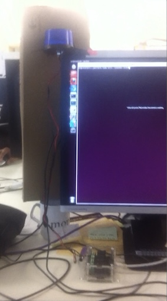

# build-alert
Polls a jenkins build status page and switches on a relay for a given period of time if the build is broken. The relay is expected to power a highly conspicuous strobe light.

One of the teams I worked in didn't have a direct way of getting alerts when the build broke. Email notifications are no use if people are just busy in their IDEs so we wanted something a little more conspicuous. 
I thought it would be fun to set up an industrial-type strobe light. I wanted a big, red strobe but at the time the only thing I could find that looked practical was a small but very bright blue mini-strobe.

Originally written in Python 2 in 2012 and tested on macOs and Ubuntu Linux.

## Hardware
This uses the ["PhidgetInterfaceKit"](https://www.phidgets.com/?prodid=1228). 
This board has big fat tracks on the switched side of the board and the relays are rated for more than 240 big man-volts of British Mains Electricity at 3 Amps. Far more than enough for my small, blue strobe light.

- You need to install the driver to get this working and this has changed on the mac: https://www.phidgets.com/docs/OS_-_macOS#Getting_started_with_macOS
- In the UK you can get this from [Active Robots](https://www.active-robots.com/1014-3-phidget-interface-kit-0-0-4.html)

## Configuration
At the top of the file `poller_with_kit.py` there are three hard-coded variables:

- `normal_poll_waiting_time` This is the number of seconds between attempts to check the build server state.
- `alert_for_seconds` The number of seconds that the relay is left open - i.e. the duration of the flashing strobe
- `after_breakage_resume_polling_after_seconds` We don't need to be continuously nagged until the build is fixed so we wait this number of seconds before we resume polling again.

## Better Modern Ways to do it?
Today there are most likely better options. 

I chose the Phidgets hardware because it was a ready-made solution and could in principle switch a mains powered lamp although I didn't need to try this. The blue strobe lamp shown in the picture is actually running on a 12V DC power adapter. 

Some other ways you could easily do this:

- Set up a Raspberry PI / Beaglebone Black as a stand-alone "build alert server" and power a relay from the GPIO pins. You can even get a fairly inexpensive ready-made interface board to handle the relay such as the [Featherwing](https://www.adafruit.com/product/3191) one from Adafruit.
- Configure a Raspberry Pi Pico microcontroller with a custom MicroPython script that connects and polls over wi-fi. It could operate a relay or even simpler and cheaper maybe just a bunch of LEDs pointing in all directions.

